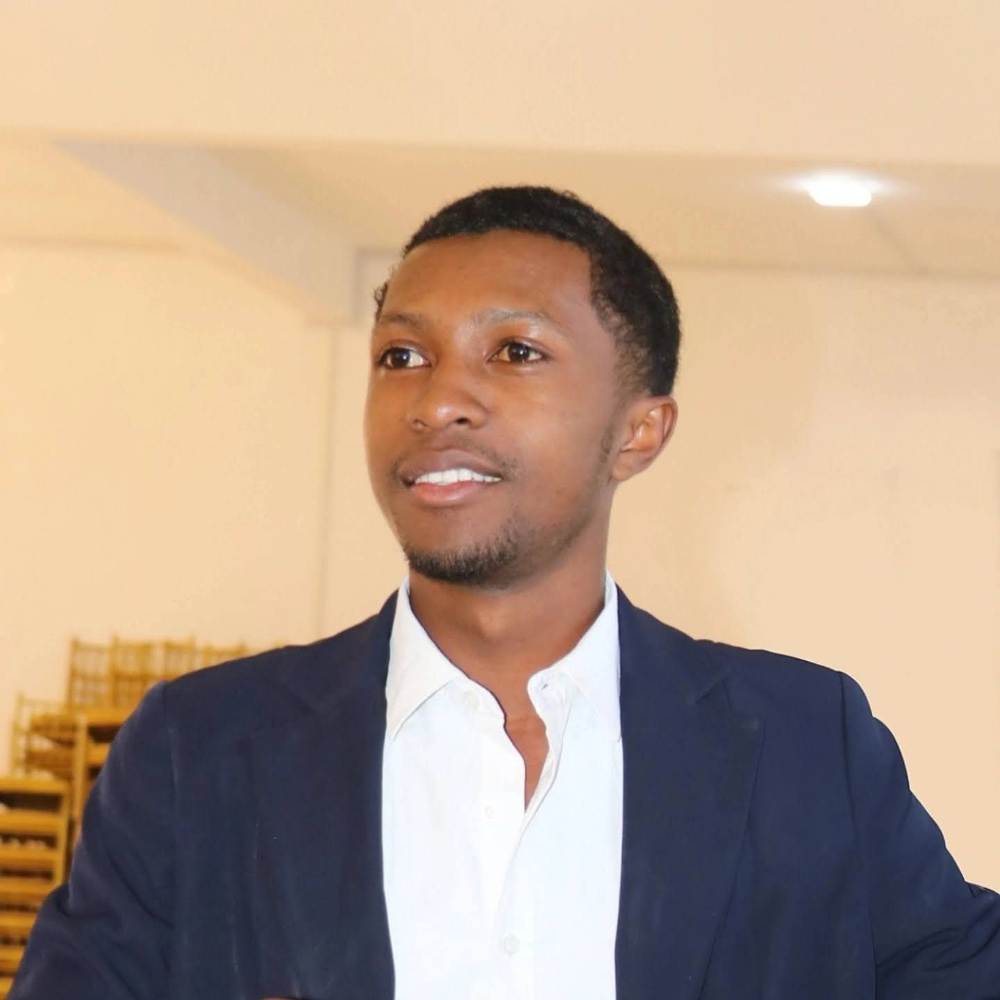

# Portfolio – Steve Ras

Bienvenue sur mon portfolio !
## Présentation

Je m’appelle **Steve Ras**. Je suis développeur fullstack passionné par la création d’applications web modernes, performantes et élégantes. Mon expertise s’étend de la conception UI/UX à l’implémentation backend, avec une forte appétence pour les technologies récentes et l’optimisation de l’expérience utilisateur.
## Compétences principales

- **Langages** : TypeScript, JavaScript, Java, PHP
- **Frameworks** : Next.js, React, Spring Boot, Laravel, Express.js
- **Bases de données** : PostgreSQL, MySQL, SQLite
- **Outils** : Git/GitHub, Docker, Vercel
- **Design** : Tailwind CSS, UI/UX, Material Design
## Projets

#### 1. EBH – Plateforme de gestion
#### 2. Cyber Café – OpenService
#### 3. Application Auto-école
#### 4. Impôts – Gestion fiscale
#### 5. Radio Tsiry
#### 6. Homevers

## À propos de moi

- **Rôle** : Développeur Fullstack & Solution Solver
- **Formation** : Informatique, réseaux, intelligence artificielle, UI/UX
- **Soft skills** : Travail en équipe, communication, résolution de problèmes, adaptabilité, gestion du temps, leadership
- **Certifications** : PIX, Huawei AI
## Contact

- 📧 Email : steve.rasoafanirindraibe@gmail.com
- 💼 LinkedIn : [linkedin.com/in/steve-rasoafanirindraibe](https://linkedin.com/in/steve-rasoafanirindraibe)
- 📄 [Télécharger mon CV](public/documents/cv_steve_non_confidentiel.pdf)

---
Merci de visiter mon portfolio !
This is a [Next.js](https://nextjs.org) project bootstrapped with [`create-next-app`](https://nextjs.org/docs/app/api-reference/cli/create-next-app).
